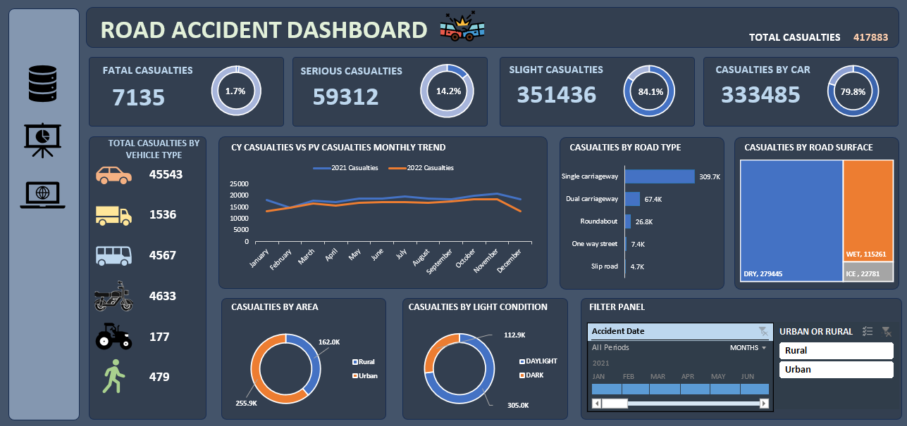

# Road Accident Analysis

An end-to-end data analytics project using **Excel, SQL Server, and Power BI** to analyze road accident casualties and identify patterns across severity, vehicle type, road type, location, and environmental conditions.

## Project Overview

The objective of this project was to analyze road accident data and develop dashboards using Excel and Power BI, supported by SQL-based data validation and analysis.

The project combines:

- **Excel** for data analysis and dashboard development
- **SQL Server** for data validation and analytical queries
- **Power BI** for data modeling, DAX calculations, and interactive dashboard development

## Key Analysis

The project analyzes:

- Total accidents and casualties
- Fatal, serious, and slight casualties
- Casualties by vehicle type
- Current-year vs previous-year casualty trends
- Casualties by road type
- Urban vs rural casualties
- Day vs night casualties
- Casualties by light conditions
- Casualties by weather conditions
- Top 10 locations by number of casualties

## Power BI Dashboard

The Power BI dashboard provides an interactive view of accident and casualty trends using KPI cards, charts, comparisons, and slicers for **Road Surface** and **Weather Conditions**.


## Excel Dashboard

An Excel dashboard was also developed to analyze road accident data through KPI cards, charts, filters, and visual comparisons.



## Key Dashboard Metrics

| Metric | Current Year |
|---|---:|
| Total Casualties | 196K |
| Total Accidents | 144.4K |
| Fatal Casualties | 1.5K |
| Serious Casualties | 18.8K |
| Slight Casualties | 124.1K |

The Power BI dashboard also shows year-over-year percentage changes for the key accident and casualty metrics.

## SQL Analysis

SQL Server was used to validate figures presented in the dashboards and perform analytical queries.

The SQL analysis includes:

- Current-year casualty and accident totals
- Casualties by severity
- Casualties by vehicle group
- Monthly casualty trends
- Previous-year comparison
- Casualties by road type
- Urban vs rural analysis
- Percentage contribution by urban/rural area
- Day vs night casualty analysis
- Top 10 locations by casualties

The complete SQL queries are available in the **SQL** folder.

## Tools & Skills

**Excel | SQL Server | Power BI | DAX | Data Analysis | Data Validation | Data Visualization | Dashboard Development | Data Modeling**

## Project Workflow

**Excel → SQL Server → Data Validation & Analysis → Power BI → Interactive Dashboards**

## Repository Contents

- **Excel** — Excel analysis and dashboard
- **Power BI** — Interactive Power BI dashboard
- **SQL** — SQL queries used for analysis and validation
- **Screenshots** — Excel and Power BI dashboard previews
- **README.md** — Project documentation

## Project Structure

```text
road-accident-analysis/
│
├── Excel/
│   └── Road Accident Analysis.xlsx
│
├── Power BI/
│   └── Road Accident Analysis.pbix
│
├── SQL/
│   └── Road_Accident_Analysis_Queries.sql
│
├── Screenshots/
│   ├── Excel-Dashboard.png
│   └── Power-BI-Dashboard.png
│
├── .gitattributes
└── README.md
