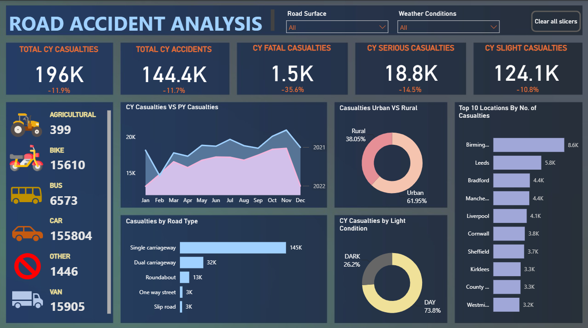

# Road Accident Analysis

An end-to-end data analytics project using **Excel, SQL Server, and Power BI** to analyze road accident casualties and identify patterns across severity, vehicle type, road type, location, and environmental conditions.

## Project Overview

The objective of this project was to analyze road accident data and build an interactive Power BI dashboard that provides a clear view of accident and casualty trends.

The project combines:

- **Excel** for data preparation and analysis
- **SQL Server** for data validation and analytical queries
- **Power BI** for data modeling, DAX calculations, and dashboard development

## Key Analysis

The dashboard analyzes:

- Total casualties and total accidents
- Fatal, serious, and slight casualties
- Casualties by vehicle type
- Current-year vs previous-year monthly casualties
- Casualties by road type
- Urban vs rural casualties
- Day vs night casualties
- Top 10 locations by number of casualties

## Dashboard

The Power BI dashboard provides an interactive view of the analysis using KPI cards, trend analysis, categorical comparisons, and slicers for **Road Surface** and **Weather Conditions**.



## Key Dashboard Metrics

| Metric | Current Year |
|---|---:|
| Total Casualties | 196K |
| Total Accidents | 144.4K |
| Fatal Casualties | 1.5K |
| Serious Casualties | 18.8K |
| Slight Casualties | 124.1K |

The dashboard also shows year-over-year percentage changes for the key casualty and accident metrics.

## SQL Analysis

SQL Server was used to validate the figures presented in the Power BI dashboard and perform analytical queries.

The SQL analysis includes:

- Current-year casualty and accident totals
- Casualties by severity
- Casualties by vehicle group
- Monthly casualty trends
- Previous-year comparison
- Casualties by road type
- Urban vs rural analysis
- Percentage contribution by urban/rural area
- Day vs night casualty analysis
- Top 10 locations by casualties

The complete SQL queries are available in the [`SQL`](SQL/) folder.

Tools & Skills

Excel | SQL Server | Power BI | DAX | Data Analysis | Data Validation | Data Visualization | Dashboard Development

Project Workflow

Excel → SQL Server → Data Validation & Analysis → Power BI → Interactive Dashboard

Repository Contents
Power BI — Interactive Power BI dashboard
SQL — SQL queries used for analysis and validation
Screenshot — Dashboard preview
Excel — Project workbook and underlying analysis

## Project Structure

```text
road-accident-analysis/
│
├── Power BI/
│   └── Road Accident Analysis.pbix
│
├── SQL/
│   └── Road_Accident_Analysis_Queries.sql
│
├── Screenshot/
│   └── Dashboard.png
│
├── Road Accident Analysis.xlsx
├── .gitattributes
└── README.md
